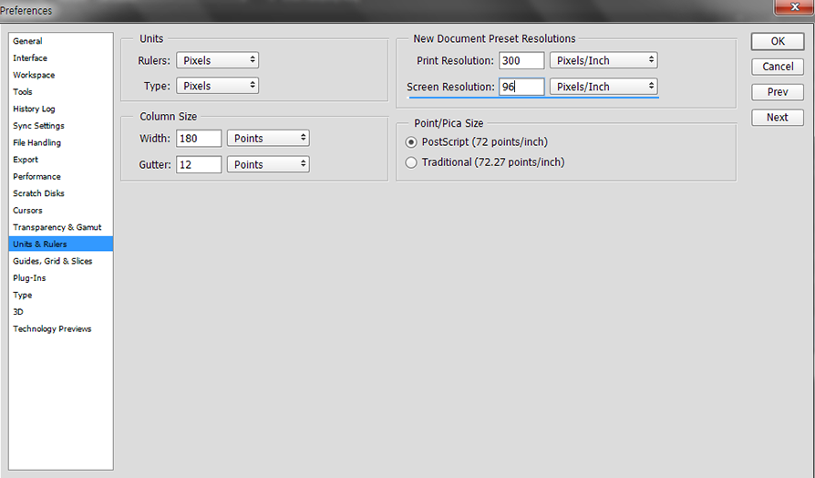

###### Front-End Develop SCHOOL

## DAY 09
- CSS 타이포그래피 속성
- CSS 배경 속성
- CSS 레이아웃 속성

---

## CSS 타이포그래피 속성
- 자간(letter-spacing) : 글자 사이 간격
- 어간(word-spacing) : 단어 사이 간격 
- 행간(행 높이, line-height): 글줄 사이 간격.
- 커닝(kerning): 특정 글자 사이의 간격을 조정하는 것. 
- 트래킹(Tracking) : 특정 글자 사이가 아닌 전체 또는 일부 선택한 텍스트 영역에서 일괄적으로 자간을 조정한다는 점이 커닝과 다름. 

### 행간(line-height)
- photoshop 기본값: 120% 
- 1.5 ~ 2 사이 값을 권장 (상대값을 사용하여 font-size 변동에 자동으로 반응하도록 입력)

```css
html {
    font-size: 100%;
}

body {
    width: 960px;
    margin-left: auto;
    margin-right: auto;
    font-size: 1rem;
    line-height: 1.5rem;
    background-image: url("../images/guide/leading-24px.png")
}

p {
    margin-bottom: 1.5rem;
}
````

### 스크린 해상도 (Screen Resolution)

#### 해상도를 96PPI로 설정한 이유는?
"웹 디자인은 웹 브라우저에서 출력되기에 웹 브라우저 환경에 맞춰서 작엽해야 합니다.
웹 브라아우저는 화면을 표시 할 때 96PPI로 처리됩니다. 웹 브라우저에서 처리하는 순수 웹 타이포그래피는 CSS로 세부 설정 값을 조정하는데, CSS를 설계할 당시 96PPI를 기준으로 했기 때문에 CSS 기준으로 디자인하는 것이 좋습니다. 비슷한 사례로 프린트 디자인 RGB가 아닌 CMYK 컬러 모드에 작업. 최종 출력되는 환경(인쇄)을 고려해야 하기 때문입니다."
> [만들면서 배우는 모던 웹사이트 디자인] 발췌 (http://www.yes24.com/24/Goods/12430947?Acode=101)



#### 96PPI에서 pt 단위를 px로 변경하는 공식
`
px = pt X (96/72)
`

### font-variant
- small-caps : 모든 문자를 크기가 작은 대문로 만듦.
- uppercase : 모든 문자를 대문자로 만듦.
- lowercase : 모든 문자를 소문로 만듦.
- capitalize : 각 단어의 첫번째 문자를 대문자로 만듦.

```css
/* 모듈화 */
.small-caps {
  font-variant: small-caps;
}
.uppercase {
  text-transform: uppercase;
}
.lowercase {
  text-transform: lowercase;
}
.capitalize {
  text-transform: capitalize;
}
```
### font 속기 작성법 
- font: size/line-height family; [순서 필수] 
  >SIFA (font-size, font-family) 
- variant, style, weight는 순서가 바뀌어도 상관 없음

```css
    .font-short-properties {
        font: 1.2rem/2rem Helvetica, Sans-Serif;
        font: italic 1.2rem/2rem Helvetica, Sans-Serif;
        font: bold 1.2rem/2rem Helvetica, Sans-Serif;
        font: bold italic 1.2rem/2rem Helvetica, Sans-Serif;
        font: italic bold 1.2rem/2rem Helvetica, Sans-Serif;
        font: italic bold small-caps 1.2rem/2rem Helvetica, Sans-Serif;
    }
```

### 자간(letter-spacing), 어간(word-spacing)
```css
.spoqa {
    letter-spacing: -0.01em;
    word-spacing: 0.01em;
}
```

## CSS 배경 속성
### IR 테크닉(Image Replacement 기법)
- 이미지와 겹친 텍스트를 보이지 않게 하지만 스크린리더가 읽을 수 있다. 접근성 이슈가 있다.

```html
<h1 class="brand-tweetle"><a href="#">Web Design</a></h1>
```

```css
.brand-github, .brand-github a {
    width: 80px;
    height: 85px;
}

.brand-github {
  overflow: hidden;
  background-image: url("../images/github.png");
  background-repeat: no-repeat;
  text-indent: -9999em;
}

.brand-github a {
  display: block;
}

```

## CSS 레이아웃 속성
### display(none, block, inline, inline-black)

#### block
- 폭은 부모만큼, 높이는 자식만큼 갖는다.
- width, heigh (O)
- margin-left, margin-right (O)
- margin-top, margin-bottom (O)
- padding-left, padding-right (O)
- padding-top, padding-bottom (O)
- float:left, float:right, position:absolute 속성을 사용하면 display 속성의 상태가 block이 되며 inline, inline-block 속성은 무시됨.

#### inline
- inline
- 폭, 높이를 자식만큼 갖는다.
- width, heigh (X)
- margin-left, margin-right (O)
- margin-top, margin-bottom (X)
- padding-left, padding-right (O)
- padding-top, padding-bottom (X)
- float:left, float:right, position:absolute 속성을 사용하면 display 속성의 상태가 block이 되며 inline, inline-block 속성은 무시됨.

#### inline-block
- 외부는 inline처럼, 내부는 block 처럼 작동.
- width, heigh (O)
- margin-left, margin-right (O)
- margin-top, margin-bottom (O)
- padding-left, padding-right (O)
- padding-top, padding-bottom (O)
- float:left, float:right, position:absolute 속성을 사용하면 display 속성의 상태가 block이 되며 inline, inline-block 속성은 무시됨.

#### none
- 보이지 않는다. 스크린리더에도 읽히지 않음.
- 어떤 장치도 이 요소를 출력하면 안됨. 
- 화면 표시(X)
- 마우스, 키보드 접근(X)
- 화면낭독기(X)
- 점자 출력기(X)
- 인쇄(X)
- 숨은 헤딩을 제공할 때 {display:none;} 으로 숨기면 화면 낭독기가 읽지 못 하기 때문에 접근성이 떨어진다.
- 화면에서 면적을 가질 수 있는 방식으로 아래에 스타일을 주면 모바일 화면 낭독기도 읽을 수 있다.

```css
.a11y-hidden {
  position: absolute;
  overflow: hidden;
  clip: rect(0,0,0,0);
  clip: rect(0 0 0 0);
  width: 1px;
  height: 1px;
  margin: -1px;
  border: 0;
  padding: 0;
}
```

### overflow (visible, hidden, auto, scroll)
- 너비와 높이가 고정된 박스는 내부 콘텐츠가 넘쳐도 자동으로 늘어나지 않는다 이 때 넘치는 내부 콘텐츠를 어떻게 처리할 것인지를 결정.
- scroll, auto 값은 터치 기반 디바이스에서 스크롤바 표현이 되지 않으므로 주의.
- visible: 기본값
- hidden: 부모보다 넘치는 자식은 보이지 않음
- auto: 내용이 넘칠경우 스크롤이 생김
- scroll: 내용이 넘치지 않아도 스크롤이 보임
- overflow-y: scroll : 구형브라우저

### float (left, right, none)
- 본래 목적은 이미지 주변으로 텍스트를 둘러싸기 위함이다.
- float 속성을 부여하면 z축(모니터 위쪽)으로 부유하게 된다. 부모 요소의 높이는 0px이 된다.
- 여러 박스의 높낮이를 다르게 설정한 후 float을 주면 float drop 현상이 일어난다.(테트리스 처럼)
- 실제 레이아웃을 위한 목적이 아니므로 float 속성을 이용할 경우 버라이어티한 경험을 할 수 있다.

```css
/* 모듈화 */
.align-left {
    float: left;
    margin-right: 1em;
}
.align-right {
    float: right;
    margin-left: 1em;
}
```
